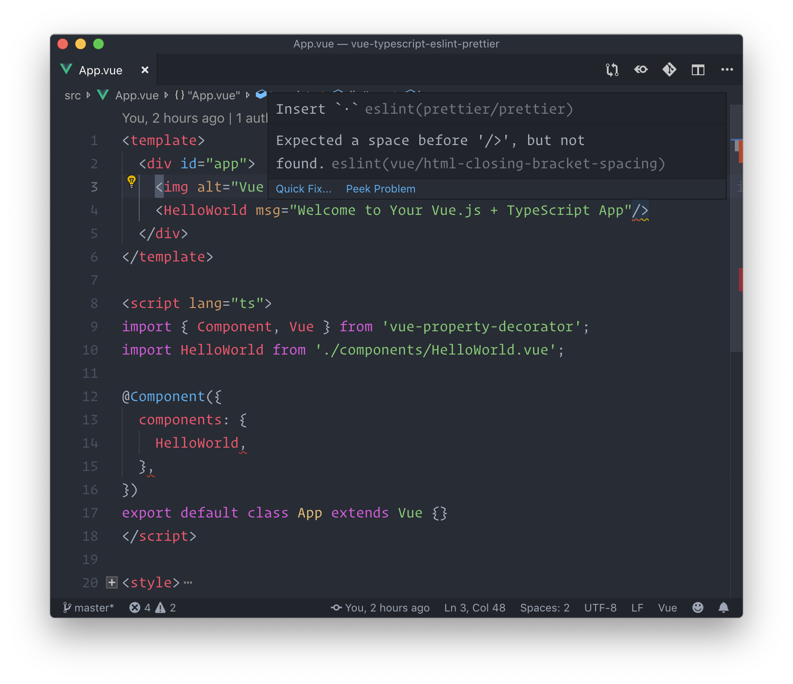

Setting up a proper linting experience can be hard when a project has multiple layers of tools or a superset language. In this tutorial, we will enforce a strict linter to catch some nasty bugs, avoid cognitive overhead and minimize arbitrary choices when working with your Vue TypeScript project. TypeScript combined to a proper linter can greatly improve your web-app.

When working on a TypeScript project, you may think it's better to use TSLint instead of ESLint, as ESLint seems to be more focused on JavaScript while TSLint have been made for TypeScript. Things have (recently) changed since February 2019, according to this [blog post](https://medium.com/palantir/tslint-in-2019-1a144c2317a9) from the TSLint team, it will be deprecated soon in favor or ESLint.

**TL;DR** of the blog post: ESLint have a **better architecture** than TSLint and the team wants to **focus on one linter** (ESLint).

# Basic ESLint setup on your Vue TypeScript project

Let's start by creating a Vue project using [vue-cli](https://github.com/vuejs/vue-cli). I will create the project using the awesome `vue ui` command, but the same steps can be done with the cli.

Make sure you create a custom preset, this will let you choose what features you want to include in your Vue project:

- Babel: this one is almost a necessity for every Vue project
- TypeScript: add TypeScript language support on your Vue project
- Linter / Formatter: add ESLint core linting library with specific Vue rules
- Use configuration files: I prefer to use configuration files instead of configuration inside the package.json as I have more control over what language I can use for a specific config (JSON or JS)

**Note**: you can add more features if needed, but we will focus on what is listed above.

Let's move to the configuration part:

- Pick a linter / fomatting config: make sure to select *ESLint + Airbnb config*
- You can also add *lint on save* and *lint and fix on commit*

It's time to edit some config files, close the vue ui and open your favorite editor.

Start by editing (or creating) the `.eslintrc.js` configuration file:

```javascript
// .eslintrc.js
module.exports = {
  root: true,
  env: {
    node: true,
  },
  extends: [
    'plugin:vue/essential', // this is a default sub-set of rules for your .vue files
    '@vue/airbnb', // plug airbnb rules but made for .vue files
    '@vue/typescript', // default typescript related rules
  ],
  rules: {
    // you can put some custom rules here
  },
  parserOptions: {
    parser: '@typescript-eslint/parser', // the typescript-parser for eslint, instead of tslint
    sourceType: 'module', // allow the use of imports statements
    ecmaVersion: 2018, // allow the parsing of modern ecmascript
  },
};
```

At this point, our linter can lint .vue files with the Airbnb rules but also understand and lint TypeScript inside .vue files (but also as .ts files).

# Implement Prettier with ESLint

[Prettier](https://prettier.io/) have a nice implementation in ESLint, it has both a [plugin](https://www.npmjs.com/package/eslint-plugin-prettier) and a [config](https://www.npmjs.com/package/eslint-config-prettier). Let's add prettier-eslint related development dependencies in our project:

```bash
yarn add prettier eslint-plugin-prettier eslint-config-prettier -D
```

- [prettier](https://www.npmjs.com/package/prettier): core library of prettier
- [eslint-plugin-prettier](https://www.npmjs.com/package/eslint-plugin-prettier): run prettier as an ESLint rule (explained later)
- [eslint-config-prettier](https://www.npmjs.com/package/eslint-config-prettier): turn off ESLint rules that might conflict with prettier, so you don't have to add a lot of rules yourself

Once those dependencies have been added, we can go back to our editor and create a `.prettierrc.js` file, which will contains the [prettier configuration](https://prettier.io/docs/en/options.html). Here is my prettier configuration that I use on my projects:

```javascript
// .prettierrc.js
module.exports = {
  printWidth: 120,
  tabWidth: 2,
  tabs: false,
  semi: true,
  singleQuote: true,
  quoteProps: 'as-needed',
  tailingComma: 'all',
  bracketSpacing: true,
  jsxBracketSameLine: false,
  arrowParens: 'always',
};
```

Once you have added a custom prettier config, go back to the `.eslintrc.js` config file. We need to add in the `.eslintrc.js` config the recently added eslint-plugin-prettier:

```javascript
// .eslintrc.js
module.exports = {
  root: true,
  env: {
    node: true,
  },
  extends: [
    'plugin:vue/essential',
    '@vue/airbnb',
    '@vue/typescript',
    'plugin:prettier/recommended', // add prettier-eslint plugin which will uses the `.prettierrc.js` config
  ],
  rules: {},
  parserOptions: {
    parser: '@typescript-eslint/parser',
    sourceType: 'module',
    ecmaVersion: 2018,
  },
};
```

Having prettier setup as an ESLint rule have a big advantage: ESLint will interpret your prettier config when linting and fixing your files with the —fix option. However, since this is a Vue project, you can fix your files with the yarn lint command (which internally uses the vue-cli-service module).

## Automatic code lint and fix in VS Code

If you are using VS Code, you can improve your developer experience by automatically running ESLint's —fix option when saving your files. In your current project, create a .vscode/settings.json file which will hold a custom VS Code config for this project, with the following content:

```json
{
  "[javascript]": {
    "editor.formatOnSave": false
  },
  "[typescript]": {
    "editor.formatOnSave": false
  },
  "eslint.autoFixOnSave": true,
  "eslint.validate": [
    "javascript",
    {
      "language": "typescript",
      "autoFix": true
    },
    {
      "language": "vue",
      "autoFix": true
    }
  ]
}
```

This VS Code configuration will:

- add JavaScript, TypeScript and Vue linting + autofix for [VS Code's ESLint extension](https://marketplace.visualstudio.com/items?itemName=dbaeumer.vscode-eslint)
- prevent running 2 formatting commands on save for JavaScript and TypeScript files

## Enabling stricter (recommended) rules on Vue files

In the `.eslintrc.js` config file, you can choose the priority of Vue related rules that will be applied. By default, the essential subset of rules is given, but you may want to [apply stricter rules](https://vuejs.github.io/eslint-plugin-vue/rules/#priority-c-recommended-minimizing-arbitrary-choices-and-cognitive-overhead). I like to use the *recommended* rules since those rules avoid cognitive overhead and minimize arbitrary choices:

```javascript
module.exports = {
  root: true,
  env: {
    node: true,
  },
  extends: [
    'plugin:vue/recommended', // enable recommended rules
    '@vue/airbnb',
    '@vue/typescript',
    'plugin:prettier/recommended',
  ],
  rules: {},
  parserOptions: {
    parser: '@typescript-eslint/parser',
    sourceType: 'module',
    ecmaVersion: 2018,
  },
};
```

**Note**: after editing the `.eslintrc.js` config file, make sure to restart your IDE to take the latest changes. It can be done in VS Code by opening the *Command Palette* ****and executing the *Reload Window* command.

That's it, you can now open any .vue file in your IDE and benefit of a strong linting experience, with an *autofix on save* in your IDE.

