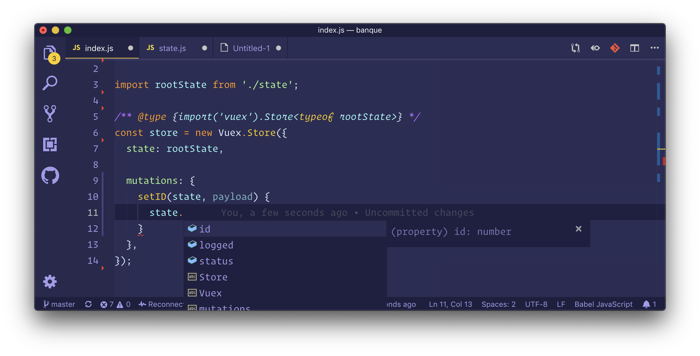
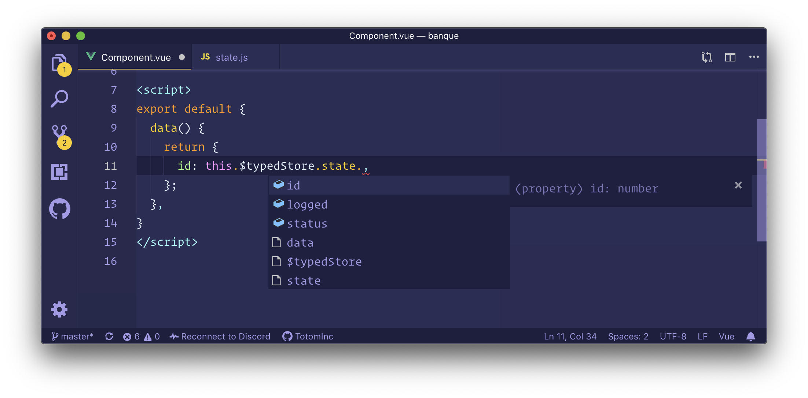

For anyone coming from Angular with `ngrx`, it is obvious to see that Vuex is not really as powerful as ngrx when it comes to type-safety (even with TypeScript).

So I tried to make my Vuex store more type-safe without TypeScript (and instead wait for Vue 3.0 for Vue + TypeScript projects) on a JavaScript project.

*Please note that the current implementation cannot interpret commit and dispatch payload types.*

# JSDoc intellisense in VS Code

The team behind VS Code made a great job in [implementing JS intellisense without being instrusive](https://code.visualstudio.com/docs/languages/javascript#_js-doc-support) on JavaScript projects.

VS Code intellisense can intepret JSDoc tags such as `@type`, `@parameter`, ... This means we can use them to define specific types of certain variables.

## Taking JSDoc's `@type` tag to next level

With the `@type` tag, we can use `import` statements to import specific types from modules. Some modules comes with a [TypeScript declaration file](https://www.typescriptlang.org/docs/handbook/declaration-files/introduction.html) which helps VS Code to interpret modules types (i.e. [Vue](https://github.com/vuejs/vue/blob/dev/types/vue.d.ts) and [Vuex](https://github.com/vuejs/vuex/blob/dev/types/index.d.ts) have both declaration files).

Let's create a basic store without using modules. The actual structure of our `src/store` folder looks like this:

```js
store/
├── state.js
└── index.js
```

Make the `rootState` of the store modular, so we can export and import it when we need it. This will serve kinda like a [TypeScript model/interface](https://www.typescriptlang.org/docs/handbook/interfaces.html):

```js
// store/state.js
const rootState = {
  id: -1,
  logged: false,
  status: 'online',
};
```

Create the store with our `rootState`:

```js
// store/index.js
import Vuex from 'vuex';

import rootState from './state';

/**
 * We can use the `import()` statement on a JSDoc `@type` tag:
 *
 * 1. `import('vuex').Store`: import the Store class which comes with a
 *    TypeScript interface, which can take 1 generic type by using the diamond
 *    operators (`<>`). This generic type must be the root-state of the store.
 *    See: https://github.com/vuejs/vuex/blob/b58d3d6a6426e901175a04bf6dcf206561cc82f5/types/index.d.ts#L16
 *
 * 2. `<typeof rootState>`: pass the `typeof` of the `rootState` object as a
 *    generic type.
 */

/** @type {import('vuex').Store<typeof rootState>} */
const store = new Vuex.Store({
  state: rootState,
});
```

Your store now have a typed (root-)state. This means you can use the typed state on your actions and mutations, inside the `store` variable.



# Typed Vuex modules

Your code base most certainly don't have all the action/mutation logic in a single `index.js` file. You are maybe using Vuex modules, and that's great, because it's easy to make your modules type-safe!

In this example, our Vuex folder structure looks like this:

```js
store/
├── modules/
│   └── user.js
├── state.js
└── index.js
```

Let's create our typed `userModule`:

```js
// store/modules/user.js
import rootState from '../state';

const userActionTypes = { ... };

const userMutationTypes = { ... };

/**
 * Define a default user state which is the type of our user module.
 * This will be used by JSDoc to determine the state type of the module, kinda
 * like a TypeScript interface/model.
 */
const userState = {
  logged: false,
  id: -1,
};

/**
 * This is actually the same thing as we saw before, but instead we are using
 * the `ActionTree` class which takes 2 generic types:
 *  1. the state of the module
 *  2. the root-state of the store
 */

/** @type {import('vuex').ActionTree<typeof userState, typeof rootState>} */
const userActions = {
  [userActionTypes.LOGIN_USER](context, payload) {
    const { email, password } = payload;

    // `context` benefit from our JSDoc `@type` tag to get a typed context,
    // i.e.: `context.rootState` or `context.state`
    context.commit(userMutationTypes.setUserID, 10);
  },
};

/**
 * Same thing as the `ActionTree`, instead we are using the `MutationTree`
 * class.
 */

/** @type {import('vuex').MutationTree<typeof userState, typeof rootState>} */
const userMutations = {
  [userMutationTypes.setUserID](state, payload) {
    // `state` benefit from our JSDoc `@type` tag to get a typed module state.
    state.id = payload;
  },
};

/**
 * We can now export our `userModule`, as a `Vuex.Module`.
 */

/** @type {import('vuex').Module<typeof userState, typeof rootState>} */
const userModule = {
  state: userState,
  actions: userActions,
  mutations: userMutations,
};

/**
 * Finally we can export our variables.
 */
export {
  userState, userModule, userActionTypes, userMutationTypes,
};
```

Update the root-state file so it will integrate the new `userModule` into the state:

```js
// store/state.js
import { userState } from './modules/user';

const rootState = {
  // Make sure to add the `userState` in the `rootState`
  user: userState,
};

export default rootState;
```

You can now import the freshly created `userModule` in the Store entry point:

```js
// store/index.js
import { userModule } from './modules/user';

const store = new Vuex.Store({
  ...,
  modules: {
    user: userModule,
  },
});
```

# Extending the store state types with a Vue declaration file

You may want to have a typed store state when you are writing your Vue SFC, because actually you don't have any autocompletion when browsing the store state in a Vue SFC.

This can be done by adding a [TypeScript declaration file](https://www.typescriptlang.org/docs/handbook/declaration-files/introduction.html), a file that VS Code will handle even when not in a TypeScript project.

However, it's a bit tricky since you can't redefine an already declared interface in TypeScript. By default, the store type is `Store<any>` (defined by Vuex declaration file), but here we want to put our `rootState` type instead of the `any` generic type, which would looks like `$store: Store<typeof rootState>`.

Since we can't redefine the property, we can create a new property `$typedStore` which will reflect the `$store` variable, and use this one when we need to access the store (using `Object.defineProperty` and `getters`).

In your root `src/` folder, create a declaration file named `vue.d.ts`:

```typescript
// src/vue.d.ts
import { Store } from 'vuex';

import rootState from './store/state';

/**
 * Add a new property `$typedStore` on our Vue components.
 *
 * The `$typedStore` is available on your components only as a type, we need to
 * bind the logic to create this variable on your Vue instance.
 */
declare module 'vue/types/vue' {
  interface Vue {
    /** It's usage is the same as `$store` */
    $typedStore: Store<typeof rootState>;
  }
}
```

Create a util file `store/bind-typed.js` which is our helper function to bind the `vm.$store` variable into `vm.$typedStore`:

```js
/**
 * Bind the `$store` property into a new variable `$typedStore`.
 * Reflect the current `$store`, it'sis needed for Typescript usage and store
 * state type-safety.
 *
 * @param {import('vue').VueConstructor} VueConstructor
 * @param {string} alias name of the new store
 */
function bindTypedStore(VueConstructor, alias = '$typedStore') {
  Object.defineProperty(VueConstructor.prototype, alias, {
    // Define a getter when accessing `$typedStore` which returns the original
    // `$store` variable of the Vue instance.
    get() {
      return this.$store;
    },
  });
}

export default bindTypedStore;
```

Last step is to call this function on your store entry point:

```js
// store/index.js
import bindTypedStore from './bind-typed';

...

Vue.use(Vuex);

// Make sure to call it after the installation of Vuex
bindTypedStore(Vue);
```

You can now access your typed store state in your Vue SFC, which is really helpful when you need to bind some data from your store to your component.



# Conclusion

Writing a semi-typed store in JavaScript is possible and easier than what you think, when using VS Code. By using few JSDoc `@type` tags and creating a Vue declaration file (`vue.d.ts`), we don't overload our code-base to add types for our store, while not editing the concept of Vuex stores (i.e. restrict usage of modules).

However, with the upcoming [3.0 of Vue](https://github.com/vuejs/vue/projects/6), we will (most likely) benefit of fully typed stores since Vue will be rewritten in TypeScript (API more TypeScript friendly and extensible), because actually it isn't possible to have types for store getters or action/mutation and dispatch payload.
